# MeusFilmes

This project was created to keep track of movies watched and view related statistics. It originated from the need to move away from a simple file-based tracking system that led to data loss.

## Online Demo

~~You can test the application at: [http://meusfilmes.shop/](http://meusfilmes.shop/)~~
The application is currently offline due to AWS hosting limits.

## Prerequisites

Before you begin, ensure you have the following installed:
- Docker
- Docker Compose

## Setup

1.  **Clone the repository (if applicable):**
    ```bash
    git clone git@github.com:felipesbarcellos/meus_filmes.git
    cd meus_filmes
    ```

2.  **Configure Environment Variables:**
    Create a `.env` file in the root of the project. You can copy the example file `.env.example` and then modify it with your specific configurations.
    ```bash
    cp .env.example .env
    ```
    Define the necessary variables in the `.env` file.

3.  **Build and Run with Docker Compose:**
    Once the `.env` file is configured, you can build and run the project using Docker Compose:
    ```bash
    docker-compose up --build -d
    ```
    The `-d` flag runs the containers in detached mode.

## Usage

After the containers are up and running, you should be able to access the application as per its configuration (e.g., via a web browser at `http://localhost`).

## Database Backup

The `db-backup` service runs automatically alongside the stack and creates a
gzipped `mysqldump` of `${MYSQL_DATABASE}` into the `./backups` directory on the
host.

- Default schedule: **once every 24 hours** (`BACKUP_INTERVAL_SECONDS=86400`).
- Backups older than **7 days** are pruned automatically (`BACKUP_RETENTION_DAYS=7`).
- Both values can be overridden in the `.env` file (see `.env.example`).
- The scheduler runs in the container and restarts automatically
  (`restart: unless-stopped`), surviving host reboots as long as the Docker
  daemon starts on boot.

### Manual backup (on demand)

To create a backup immediately without waiting for the next cycle:

```bash
./run_backup.sh
```

This uses the `backup` service (profile `tools`) and uses the same script.

### Restore

```bash
gunzip -c backups/<arquivo>.sql.gz | docker compose exec -T db mysql -uroot -p"$MYSQL_ROOT_PASSWORD" "$MYSQL_DATABASE"
```

> Backups are stored only on the local host disk. There is no offsite copy, so a
> disk failure would lose both the database and its backups.

### Future improvements

- `scripts/restore.sh`: an interactive helper to list available backups and
  restore a selected one, including a confirmation prompt and pre-restore
  safety backup.
- Offsite replication (e.g. S3/rclone) of the generated `.sql.gz` files.

## Status & Roadmap

- Password recovery functionality is still pending implementation.
- Movie rating system is still pending implementation.


## Screenshots

Below are some screenshots of the application in use:

| Home (Guest) | Home (Logged In) |
|:---:|:---:|
| 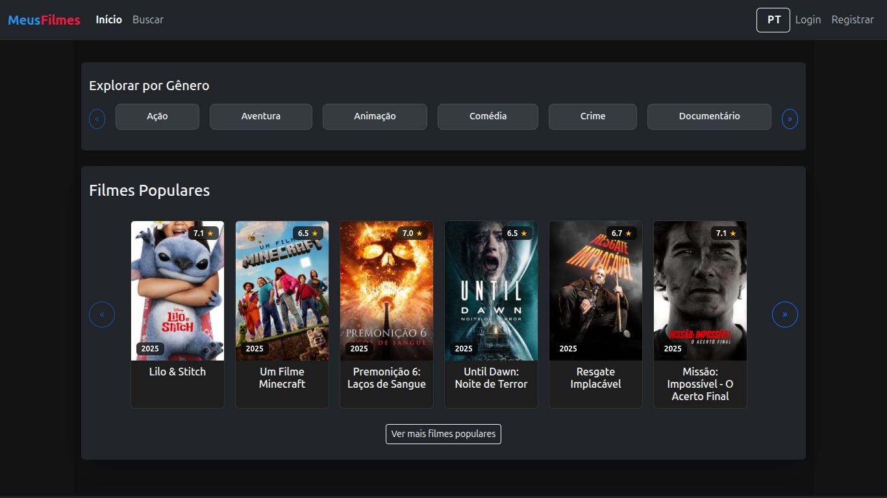 | 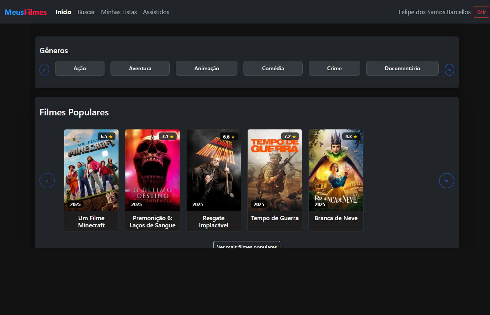 |

| Register | Login |
|:---:|:---:|
| 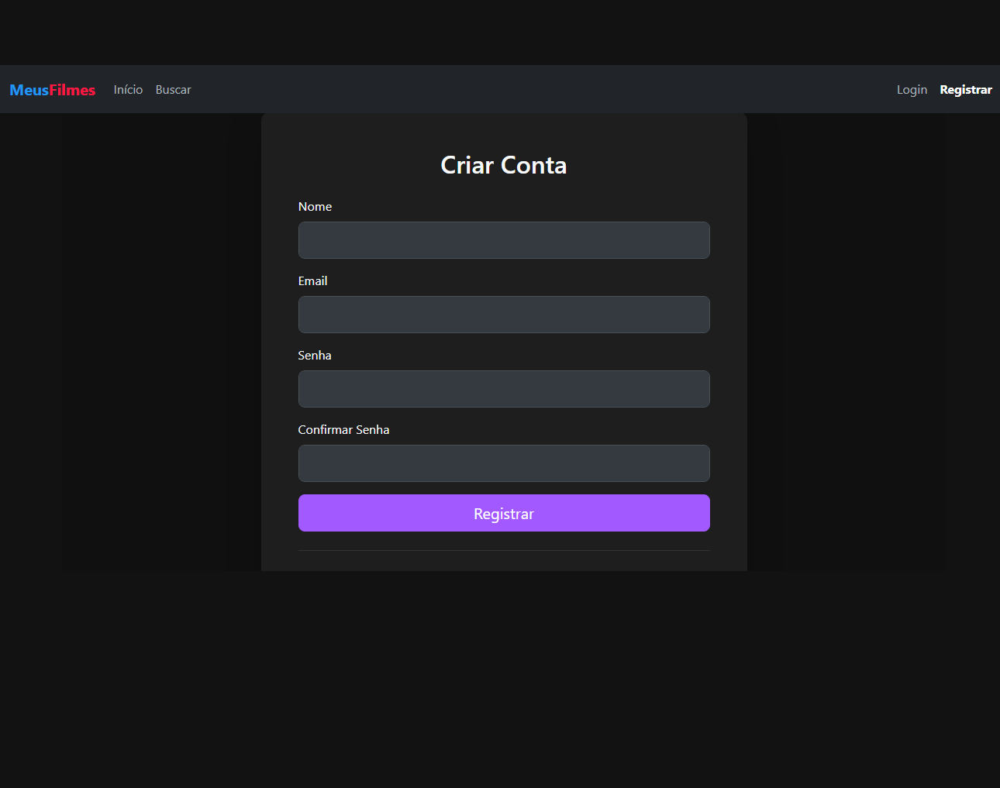 | 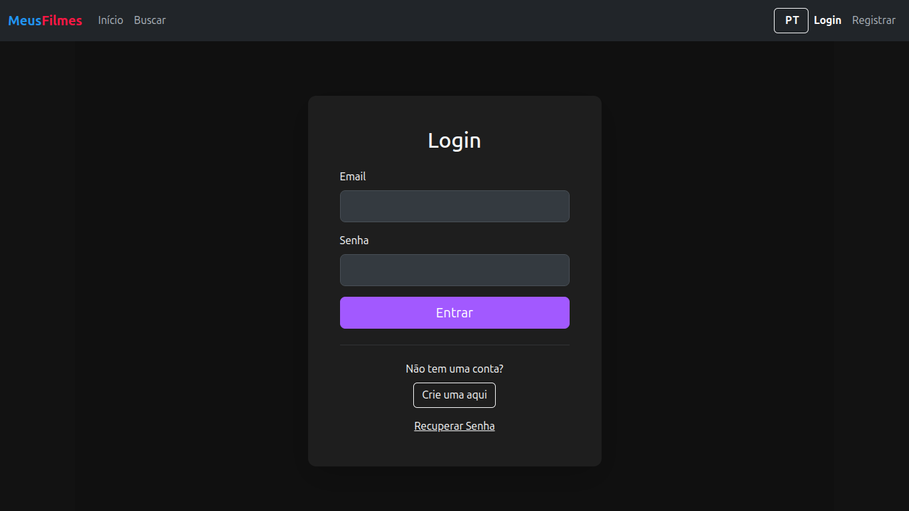 |

| Search | Search Example |
|:---:|:---:|
| 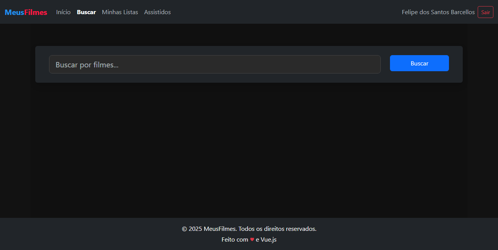 | 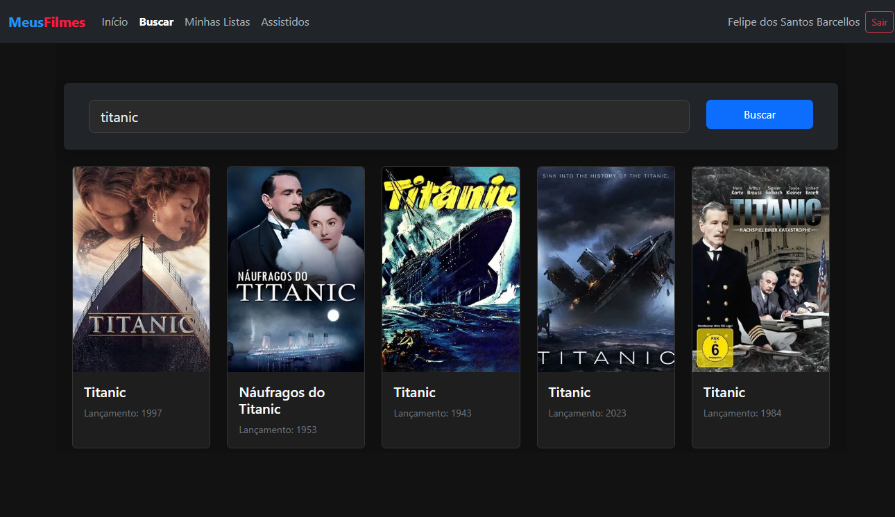 |

| Movie Detail | Add to List |
|:---:|:---:|
| 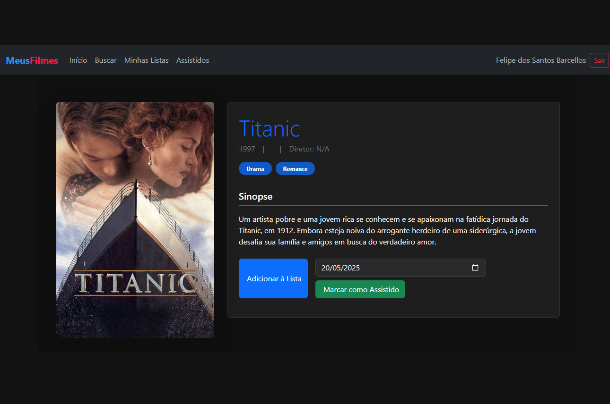 | 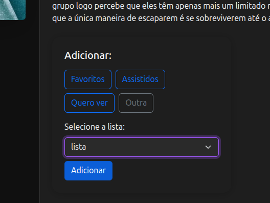 |

| My Lists | List Detail |
|:---:|:---:|
| 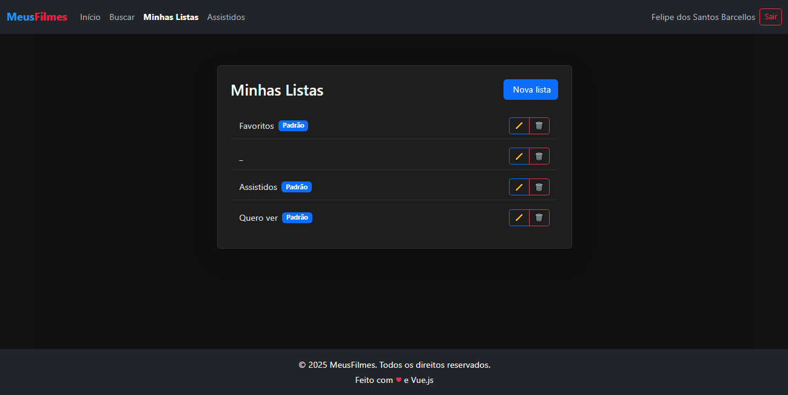 | 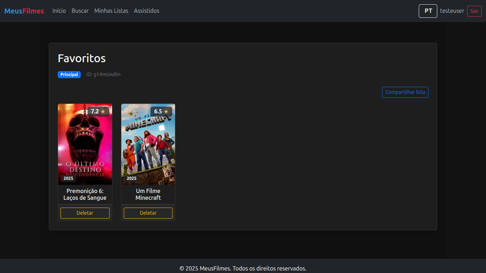 |

| Mark as Watched | Watched List |
|:---:|:---:|
| 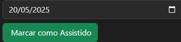 | 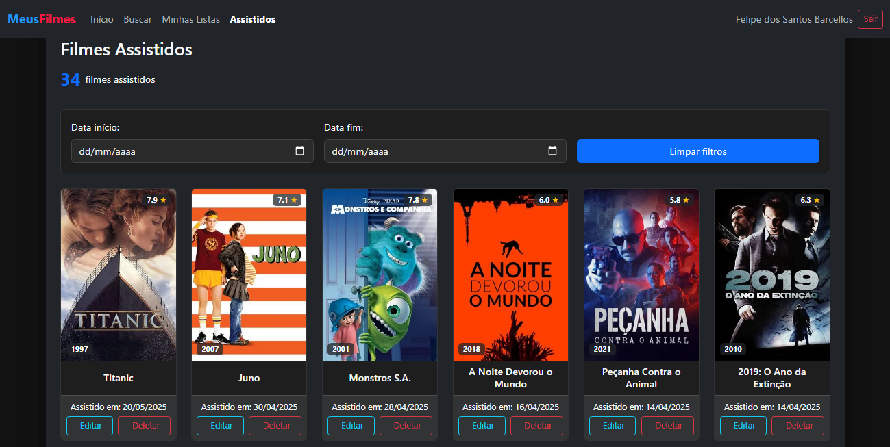 |

> All screenshots are located in the `screenshots/` directory.

