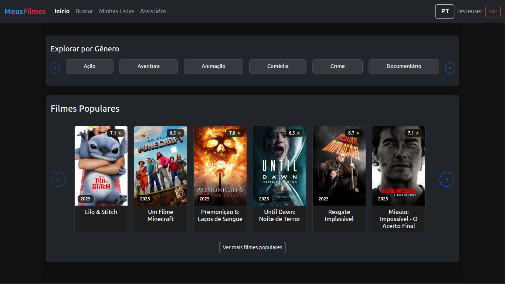
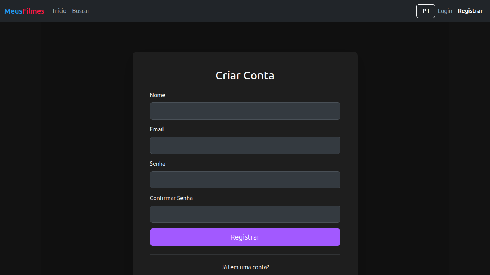
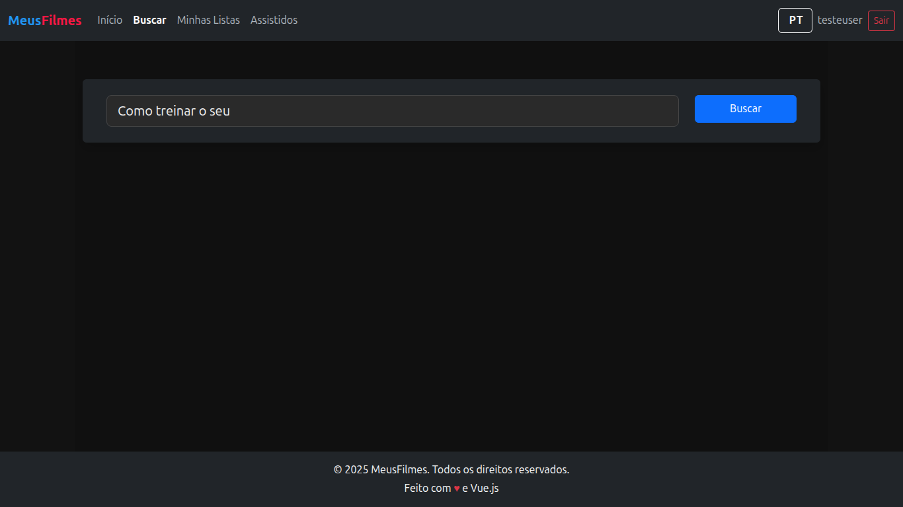
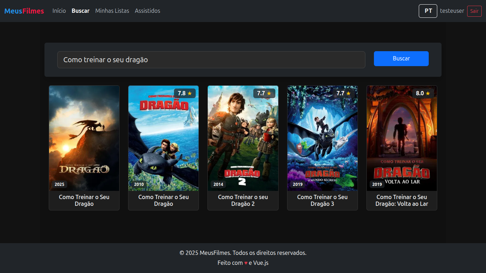
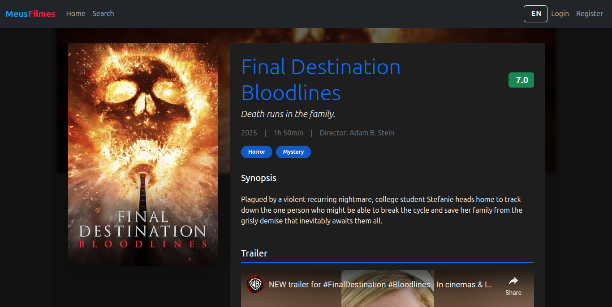
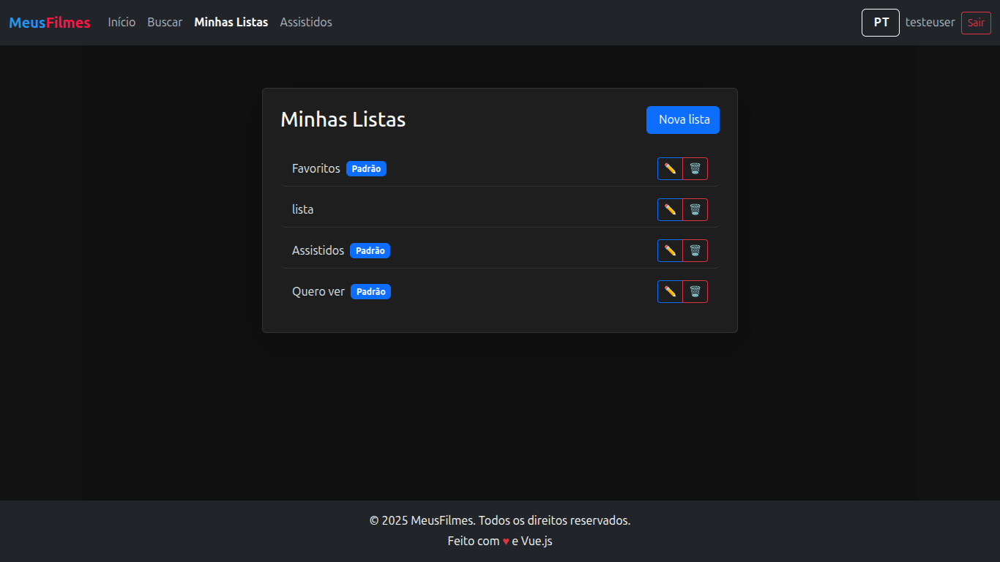
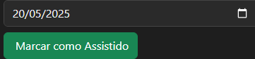
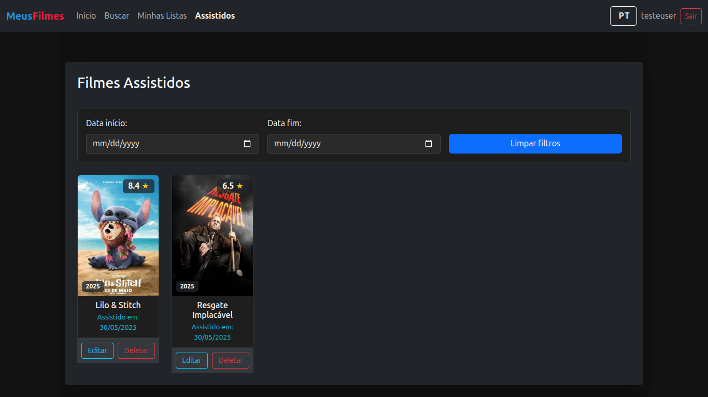

# MeusFilmes

This project was created to keep track of movies watched and view related statistics. It originated from the need to move away from a simple file-based tracking system that led to data loss.

## Online Demo

You can test the application at: [https://meusfilmes.loophole.site/](https://meusfilmes.loophole.site/)

## Prerequisites

Before you begin, ensure you have the following installed:
- Docker
- Docker Compose

## Setup

1.  **Clone the repository (if applicable):**
    ```bash
    git clone git@github.com:felipesbarcellos/meus_filmes.git
    cd meus_filmes
    ```

2.  **Configure Environment Variables:**
    Create a `.env` file in the root of the project. You can copy the example file `.env.example` and then modify it with your specific configurations.
    ```bash
    cp .env.example .env
    ```
    Define the necessary variables in the `.env` file.

3.  **Build and Run with Docker Compose:**
    Once the `.env` file is configured, you can build and run the project using Docker Compose:
    ```bash
    docker-compose up --build -d
    ```
    The `-d` flag runs the containers in detached mode.

## Usage

After the containers are up and running, you should be able to access the application as per its configuration (e.g., via a web browser at `http://localhost`).

## Status & Roadmap

- Password recovery functionality is still pending implementation.
- Movie rating system is still pending implementation.


## Screenshots

Below are some screenshots of the application in use:

| Home (Guest) | Home (Logged In) |
|:---:|:---:|
|  |  |

| Register | Login |
|:---:|:---:|
|  |  |

| Search | Search Example |
|:---:|:---:|
|  |  |

| Movie Detail | Add to List |
|:---:|:---:|
|  |  |

| My Lists | List Detail |
|:---:|:---:|
|  |  |

| Mark as Watched | Watched List |
|:---:|:---:|
|  |  |

> All screenshots are located in the `screenshots/` directory.
